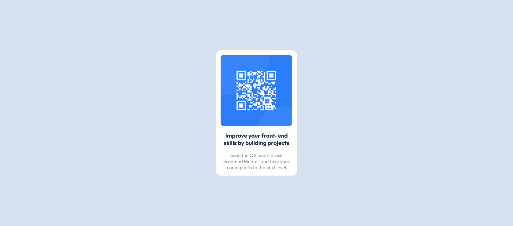

# Frontend Mentor - QR code component solution

This is a solution to the [QR code component challenge on Frontend Mentor](https://www.frontendmentor.io/challenges/qr-code-component-iux_sIO_H). Frontend Mentor challenges help you improve your coding skills by building realistic projects. 

## Table of contents

- [Overview](#overview)
  - [Screenshot](#screenshot)
  - [Links](#links)
- [My process](#my-process)
  - [Built with](#built-with)
  - [What I learned](#what-i-learned)
  - [Continued development](#continued-development)
- [Author](#author)

## Overview

This is a project to test beginner level skills in Css and HTML.
It is a component that can be re-used in future projects.

### Screenshot



### Links

- Solution URL: [Add solution URL here](https://your-solution-url.com)
- Live Site URL: [Add live site URL here](https://your-live-site-url.com)

## My process
- I created a grid with three columns and one row
- I then placed the main container in the second column to keep it centered on the page
- The image was nested in the main container, in a seperate container 😁
- text paragraphs was placed in another div, also inside the main container.

### Built with

- Semantic HTML5 markup
- CSS custom properties
- CSS Grid
- Css for styling

### What I learned

- Centering a div using Css grid

```html
<div class="grid-container">
    <div class="main-container"></div>
</div>
```
```css
.grid-container{
    display: grid;
    grid-template-columns: repeat(3, 1fr);
    grid-gap: 5px;
    margin-top: 10%;
    margin-left: 5%;
    margin-right: 5%;
    margin-bottom: 10%;
    place-items: center;
}
.main-container{
    border-radius: 15px 15px 15px 15px;
    border: 1px solid hsl(0, 0%, 100%);
    display: inline-block;
    width: 250px;
    grid-column-start: 2; 
    background-color: hsl(0, 0%, 100%);   
}
```

### Continued development

- Css grid and styling
- Centering a Div 🤐 - surprising, i know

## Author

- Website - [Aromi Benard](https://www.your-site.com)
- Frontend Mentor - [@aromibenard](https://www.frontendmentor.io/profile/aromibenard)